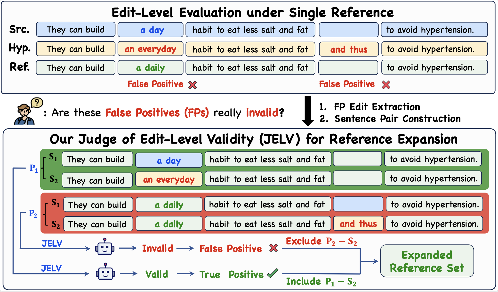
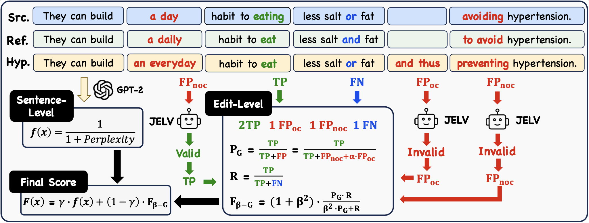

# JELV: A Judge of Edit-Level Validity

This repository contains the code and data for the AAAI26 (**Oral**) paper _“JELV: A Judge of Edit-Level Validity for Evaluation and Automated Reference Expansion in Grammatical Error Correction.”_

JELV introduces an edit-level validity judge and an integrated evaluation metric **F(x)** that combines edit-level reasoning, fluency assessment, and a unified scoring formulation. The metric supports both system-level and sentence-level evaluation and is compatible with existing M2-format GEC datasets.



## 📦 Repository Overview

```text
.
├── README.md
├── data
│   ├── benchmark
│   └── train
└── evaluation
    ├── FluencyScorer
    ├── JELV_based_cleme
    ├── JELV_based_cleme_cache
    ├── JudgeModel
    ├── demo
    └── scripts
```

### 🎯 Data

We release the two datasets we curated and proposed in our work.

* **Benchmark (PEVData)**
   A human-annotated pairwise edit-level validity dataset containing **1,459 valid** and **1,338 invalid** edit pairs. This dataset serves as a high-quality benchmark for edit-level validity judgment.
* **Train Set**
  A JELV-filtered, LLM-expanded version of BEA-19 dev sets in **M2 format**, included to retrain the top-performing GEC models in the paper.

### 🧠 Evaluation Workflow: JELV-based F(x)

The `evaluation/` directory includes the full implementation of the **F(x)** metric:

#### **1. Base metric**

 [CLEME](https://github.com/THUKElab/CLEME). We choose it becuase our edit-level metric is based on F-score and CLEME is a leading F-metric based metric.

#### **2. Edit-level metric**

 Our enhanced edit-level metric integrates two components:

* **JELV-based reclassification**
   False-positive (FP) edits discovered during evaluation are routed to JELV for validity judgment.
* **FP decoupling**
  Separates genuine FP errors into overcorrection and over-correction according to whether the edit span in the source sentence is already correct.

##### Implementations

* **JELV_based_cleme**
  performs JELV inference on-the-fly: any edit initially flagged as a false positive (FP) during evaluation is sent to JELV for validity checking. This integrates directly into the full JELV-based $\mathrm{F(x)}$ workflow but incurs substantial evaluation overhead.
* **JELV_based_cleme_cache**
  uses a precomputed cache of all FP-classified edits along with their JELV-validated labels. During evaluation, cached edits bypass inference and immediately return their stored validity—dramatically reducing runtime without compromising accuracy. We employ this "cache" version into our final evaluation workflow.

#### **3. Sentence-level metric**

The `FluencyScorer/` module computes fluency scores using our sentence-level modeling approach.

#### **4. Final Metric**

JELV-based $\mathrm{F(x)}$, combining edit-level and sentence-level metrics.



---

## ⚒️ How to Use Our Evaluation Metric

### ⚙️ Installation & Setup

```
cd evaluation
pip install -r requirements.txt
```

### 🔍 Selecting a JELV Model

#### **JELV 1.0 (LLM-as-Judges Pipeline)**

- Full prompts are released in **Appendix G** of the paper.
- Provides the **highest judgment accuracy**.
- Suitable when dataset size is moderate.
- Cost: ~**$0.0007 per judgment** using DeepSeek-V3 API.

#### **JELV 2.0 (Fine-tuned DeBERTa Checkpoint)**

Download the released checkpoints on [google drive](https://drive.google.com/drive/folders/1Gx4K8LNFvzlC9WVIPjUVYGe6CTDRUGHe?usp=sharing). Place them under:

```
evaluation/JudgeModel
```

**Recommendation:**

- Use **JELV 1.0** for highest accuracy.
- Use **JELV 2.0** for very large-scale evaluation where efficiency matters.

### 🚀 Quick Start

```bash
python scripts/JELV_based_Fx.py --ref demo/ref.m2 --hyp demo/hyp.m2 --alpha 0.5 --gamma 0.5 --level system
```

You can configure the hyperparameters according to the optimal settings detailed in Appendix E.

* Guidelines

  ```bash
  python scripts/JELV_based_Fx.py --help
  ```

  This command will output:

  ```bash
  usage: JELV_based_Fx.py --ref REF.m2 --hyp HYP.m2 [--alpha α] [--gamma γ] [--level system|sentence]
  
  Compute combined JELV‐based F(x): (1 - γ)·A + γ·B
  
  options:
    -h, --help            show this help message and exit
    --ref REF             Reference M2 file
    --hyp HYP             Hypothesis M2 file
    --alpha ALPHA         α for the generalized F (default: 0.5)
    --gamma GAMMA         γ weight for fluency term (default: 0.5)
    --level {system,sentence}
                          Evaluation level:
                            system   → single combined score
                            sentence → one combined score per sentence
  ```

## 🤝 Community & Contribution

We welcome contributions from the research and open-source community, including:

* More advanced training techques to enhance the prediction accuracy of JELV 2.0
* Extensions of JELV to error-correction tasks of other languages
* Improvements to sentence-level modeling
* More performance gains to retraining on top GEC systems

Feel free to open an issue or submit a pull request!

## 📄 Citation

If you use JELV, or the datasets in this repository, please cite our AAAI 2026 paper:

```
@article{zhan2025jelv,
  title={JELV: A Judge of Edit-Level Validity for Evaluation and Automated Reference Expansion in Grammatical Error Correction},
  author={Zhan, Yuhao and Zhang, Yuqing and Yuan, Jing and Ma, Qixiang and Yang, Zhiqi and Gu, Yu and Liu, Zemin and Wu, Fei},
  journal={arXiv preprint arXiv:2511.21700},
  year={2025}
}
```